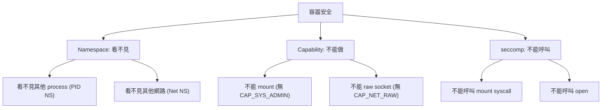

# Capability (能力)

## 概述

Capability (能力) 是 Linux 核心的安全模型，將 root 的完整權限分割為獨立的、細粒度的小單位。例如，一個 process 可能只需要 `CAP_NET_RAW` 來建立原始 socket，而不需要完整的 root 權限。

傳統 Unix 的權限模型是二元的：UID 0 擁有一切，非零 UID 幾乎無權限。Capability 模型打破了這個限制，讓 process 只擁有完成任務所需的最小權限集合——這稱為最小權限原則 (principle of least privilege)。

## 歷史

- **1979**: Dennis Ritchie 在 Bell Labs 提出能力概念
- **1997**: POSIX 1003.1e 草案定義標準能力模型
- **1999**: Linux 2.2 引入初始能力實作
- **2008**: Linux 2.6.25 擴展為 5 集合模型 (加入 Ambient)
- **2015**: Linux 4.3 完全實作 Ambient 集合

## 能力列表

xv8 定義 41 個能力，編號 0-40，對應 Linux 標準：

| 編號 | 常數 | 說明 |
|------|------|------|
| 0 | `CAP_CHOWN` | 變更檔案擁有者 |
| 1 | `CAP_DAC_OVERRIDE` | 跳過 DAC 權限檢查 |
| 2 | `CAP_DAC_READ_SEARCH` | 跳過 DAC 讀取/搜尋檢查 |
| 3 | `CAP_FOWNER` | 跳過檔案擁有者檢查 |
| 4 | `CAP_FSETID` | 設定 setuid/setgid 位元 |
| 5 | `CAP_KILL` | 跨 session 發送訊號 |
| 6 | `CAP_SETGID` | 設定 GID |
| 7 | `CAP_SETUID` | 設定 UID |
| 8 | `CAP_SETPCAP` | 設定其他 process 的能力 |
| 9 | `CAP_LINUX_IMMUTABLE` | 設定 FS_IMMUTABLE_FL |
| 10 | `CAP_NET_BIND_SERVICE` | 繫結低於 1024 的埠 |
| 11 | `CAP_NET_BROADCAST` | 網路廣播 |
| 12 | `CAP_NET_ADMIN` | 網路管理 |
| 13 | `CAP_NET_RAW` | 原始 socket |
| ... | ... | ... |
| 40 | `CAP_PERFMON` | 效能監控 (Linux 5.8+) |

完整列表見 `kernel/src/capability.rs` 中的 `Capability` 枚舉。

## 五集合模型

```
初始狀態 (以 UID 0 process 為例):
  Permitted:   全 1 (所有能力)
  Effective:   全 1
  Inheritable: 全 0
  Ambient:     全 0
  Bounding:    全 1

exec 後 (一般 binary):
  Permitted:   Ambient ∩ Permitted (繼承)
  Effective:   0 (除非 binary 有檔案能力)
  Inheritable: Inheritable
  Ambient:     Ambient ∩ Permitted'

exec SUID binary:
  Effective 根據 SUID 位元與檔案能力決定
```

## capget/capset 系統呼叫

xv8 的 `capget`/`capset` 與 Linux 完全相容：

```rust
// 讀取目前 process 的能力
let mut data = CapData { ... };
capget(core::ptr::null(), &mut data)?;

// 設定能力 (僅能移除，不能新增超出 Permitted 集合)
let new = CapData { effective: some_set, ... };
capset(core::ptr::null(), &new)?;
```

## 與容器安全的關係



## 相關文件

- [Wiki: seccomp](seccomp.md)
- [Wiki: 容器](Container.md)
- [Wiki: Namespace](Namespace.md)
- [xv8 kernel: capability.rs](../../xv8/kernel/src/capability.md)
- [_doc/v5.3.md](../../_doc/v5.3.md)
