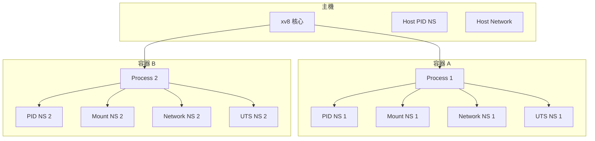
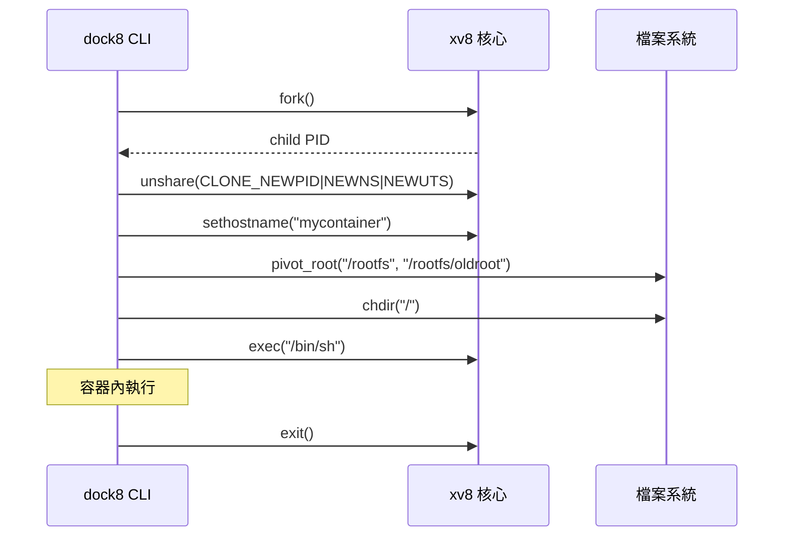

# 容器 (Container)

## 概述

容器 (container) 是一種作業系統層級的虛擬化技術，讓多個獨立的使用者空間實例共享同一個核心。與虛擬機器 (virtual machine) 不同，容器不需要模擬硬體或執行獨立的核心，因此啟動速度快、資源開銷低。

xv8 從 v5.0 開始支援容器功能，透過 namespace、cgroup、OverlayFS、veth pair、pivot_root 等核心機制，提供接近 Docker 的容器隔離體驗。

## 核心概念



## 容器 vs 虛擬機器

| 特性 | 容器 | 虛擬機器 |
|------|------|----------|
| 核心 | 共享主機核心 | 各自獨立核心 |
| 啟動時間 | 毫秒級 | 秒級 |
| 隔離程度 | 作業系統層級 | 硬體層級 |
| 資源開銷 | 極低 (僅額外 process) | 較高 (需 Guest OS) |
| 檔案系統 | OverlayFS 分層 | 獨立磁碟映像 |

## xv8 容器實作

xv8 的容器功能由以下核心機制組成：

### 1. Namespace (命名空間)

Namespace 是容器隔離的基礎，xv8 支援 7 種類型：

| 類型 | Linux 旗標 | xv8 旗標 | 隔離內容 |
|------|-----------|----------|---------|
| Mount | `CLONE_NEWNS` | `0x00020000` | 檔案系統掛載點 |
| Cgroup | `CLONE_NEWCGROUP` | `0x02000000` | cgroup 根目錄 |
| UTS | `CLONE_NEWUTS` | `0x04000000` | 主機名稱與 NIS domain |
| IPC | `CLONE_NEWIPC` | `0x08000000` | System V IPC 與 POSIX message queue |
| User | `CLONE_NEWUSER` | `0x10000000` | 使用者與群組 ID |
| PID | `CLONE_NEWPID` | `0x20000000` | Process ID 編號空間 |
| Net | `CLONE_NEWNET` | `0x40000000` | 網路裝置、IP、路由表 |

### 2. cgroup (控制群組)

cgroup 限制容器可使用的資源（CPU、記憶體、行程數）。xv8 使用字元裝置 `/dev/cgroup` (major=2) 與使用者空間透過文字協定溝通。

### 3. pivot_root

`pivot_root(new_root, put_old)` 系統呼叫將當前 root 檔案系統切換到新目錄，同時將舊 root 掛載到 `put_old`。這是容器檔案系統隔離的關鍵步驟。

xv8 的實作透過 `data.root: Option<Inode>` 記錄每個 process 的 root 目錄，`resolve_inner` 在解析絕對路徑時使用 per-process root。

### 4. OverlayFS

OverlayFS 提供「分層檔案系統」(layered filesystem)，讓多個唯讀層疊加一個可寫層，實現容器映像的共用與寫入時複製 (copy-on-write)。

### 5. Veth Pair

Veth pair (virtual Ethernet) 是一對虛擬網路卡，一端的封包會自動出現在另一端。xv8 使用 `ioctl(fd, XV8_VETH_CREATE=100, ...)` 在 socket fd 上建立 veth pair，實現容器與主機的網路連接。

### 6. nsopen 系統呼叫

xv8 沒有 `/proc` 檔案系統，因此無法使用 Linux 的 `open("/proc/<pid>/ns/<type>")` 模式。xv8 定義了專用的 `nsopen(pid, nstype)` 系統呼叫 (編號 150)，回傳一個 namespace fd。`setns` 可透過此 fd 加入目標 process 的 namespace。

## dock8 CLI

xv8 提供 `dock8` 工具管理容器：

```bash
dock8 run mycontainer /bin/sh    # 啟動容器
dock8 exec mycontainer /bin/ls   # 進入容器執行命令
dock8 ps                          # 列出容器
dock8 rm mycontainer              # 刪除容器
```

## 容器生命週期



## 相關系統呼叫

| 編號 | 名稱 | 用途 |
|------|------|------|
| 140 | `unshare` | 建立新 namespace |
| 141 | `setns` | 加入 namespace |
| 142 | `capget` | 取得能力 |
| 143 | `capset` | 設定能力 |
| 144 | `seccomp` | 設定 seccomp 過濾器 |
| 145 | `pivot_root` | 切換 root 檔案系統 |
| 146 | `sethostname` | 設定主機名稱 |
| 147 | `gethostname` | 取得主機名稱 |
| 148 | `overlay_mount` | 掛載 OverlayFS |
| 149 | `overlay_umount` | 卸載 OverlayFS |
| 150 | `nsopen` | 開啟 namespace fd |

## 相關文件

- [Wiki: Namespace](Namespace.md)
- [Wiki: cgroup](cgroup.md)
- [Wiki: OverlayFS](OverlayFS.md)
- [Wiki: seccomp](seccomp.md)
- [Wiki: Capability](Capability.md)
- [xv8 kernel: namespace.rs](../../xv8/kernel/src/namespace.md)
- [xv8 kernel: cgroup.rs](../../xv8/kernel/src/cgroup.md)
- [xv8 kernel: overlay.rs](../../xv8/kernel/src/overlay.md)
- [_doc/v5.1.md Namespace](../../_doc/v5.1.md)
- [_doc/v5.7.md dock8 CLI](../../_doc/v5.7.md)
