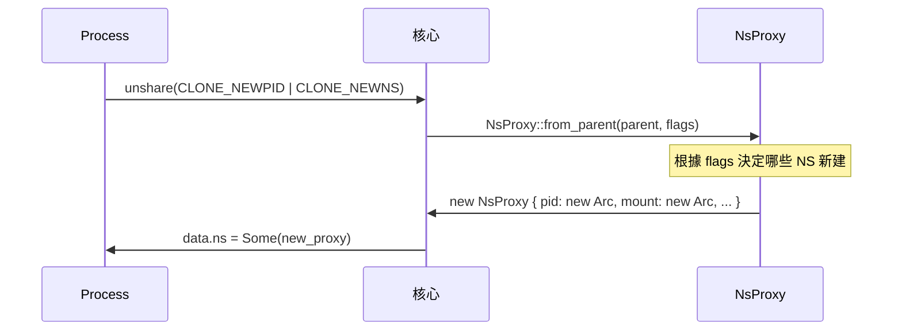

# Namespace (命名空間)

## 概述

Namespace (命名空間) 是 Linux 核心提供的一種資源隔離機制，讓一組 process 只能看到與自己 namespace 相關的資源。xv8 從 v5.1 開始支援完整的 7 類型 namespace 系統。

Namespace 的概念最早出現在 Plan 9 作業系統，2002 年被引入 Linux 核心。容器技術 (Docker、LXC) 的核心依賴就是 namespace。

## 基本原理

每個 process 都關聯到一組 namespace（每種類型一個）。當 process 呼叫 `unshare()` 或 `clone()` 時帶入 `CLONE_NEW*` 旗標，核心會建立新的 namespace 並將 process 與其關聯。此後該 process 及其子 process 只能看見所屬 namespace 內的資源。

```
傳統 Unix 視圖：
  PID 1 ── PID 2 ── PID 3
  所有 process 共享同一個 PID 空間

Namespace 隔離後：
  Host PID NS:        PID 1 ── PID 5 (容器 init) ── ... 
                                   │
  Container PID NS:            PID 1 (容器 init) ── PID 2 ── PID 3
```

## xv8 的 NsProxy 模型

xv8 使用 `NsProxy` 結構體管理所有 namespace 類型：

```rust
pub struct NsProxy {
    pub pid: Arc<PidNamespace>,
    pub uts: Arc<UtsNamespace>,
    pub mount: Arc<MountNamespace>,
    pub net: Arc<NetNamespace>,
    pub ipc: Arc<IpcNamespace>,
    pub user: Arc<UserNamespace>,
    pub cgroup: Arc<CgroupNamespace>,
}
```

每個 namespace 類型有獨立的 `Arc` ptr，實現共用語意：多個 process 可以共用同一個 namespace（透過 clone 同一份 Arc）。

### 建立流程



## 7 種 Namespace 類型

### PID Namespace

PID namespace 讓容器內的 process 擁有獨立的 PID 編號空間。容器內的第一個 process 會獲得 PID 1，容器外的 process 完全看不見容器內的 PID。

xv8 的 `PidNamespace` 結構：
```rust
pub struct PidNamespace {
    pub id: NamespaceId,
}
```

### Mount Namespace

Mount namespace 隔離檔案系統掛載點。process 在 mount namespace 內進行的掛載/卸載操作不會影響其他 namespace。xv8 的 `MountNamespace` 結構類似。

**與 pivot_root 的關係**: Mount namespace 與 `pivot_root` 系統呼叫結合使用，可實現容器完整的檔案系統隔離。

### UTS Namespace

UTS namespace 隔離主機名稱 (hostname) 與 NIS domain name。容器可設定自己的 hostname，不影響主機。

xv8 使用 `UtsData` 儲存 hostname：
```rust
pub struct UtsData {
    pub name: [u8; 64],
}
```

### IPC Namespace

IPC namespace 隔離 System V IPC 物件（訊息佇列、信號量、共用記憶體）與 POSIX message queue。目前 xv8 的 IPC namespace 為骨架實作，尚無具體的 IPC 機制。

### User Namespace

User namespace 隔離使用者與群組 ID。容器內可擁有自己的 root 使用者 (UID 0)，不需要主機的特權。xv8 的使用者 namespace 為骨架實作，搭配 `capget`/`capset` 系統呼叫提供能力隔離。

### Cgroup Namespace

Cgroup namespace 隔離 cgroup 檔案系統的根目錄。容器內的 process 看到的是相對於自己 cgroup 的視圖，無法看到上層的 cgroup 層級。xv8 的 cgroup namespace 與 `/dev/cgroup` 字元裝置配合使用。

### Net Namespace

Net namespace 隔離網路堆疊，包括：
- 網路裝置（eth0, lo 等）
- IPv4/IPv6 位址
- 路由表
- 防火牆規則
- socket 連線

xv8 的 net namespace 與 veth pair 配合，實現容器網路隔離與連接。

## 系統呼叫

### unshare

`unshare(flags: usize)` — 建立新的 namespace 並將當前 process 移入：

```rust
// 建立新的 PID + Mount + UTS namespace
let _ = unshare(CLONE_NEWPID | CLONE_NEWNS | CLONE_NEWUTS);
```

### setns

`setns(fd: Fd, nstype: u32)` — 透過 namespace fd 加入目標 process 的 namespace。用於 `dock8 exec`：

```rust
let ns_fd = nsopen(target_pid, 5)?;  // 5 = PID namespace
setns(ns_fd, 0)?;                     // 加入目標的 PID namespace
```

### nsopen

`nsopen(pid: usize, nstype: u32) -> Fd` — xv8 專用系統呼叫 (編號 150)，因為系統無 `/proc` 檔案系統。回傳的 fd 包含目標 process 的 `NsProxy` 與請求的 namespace 類型。

## 實作細節

### NsFd 檔案類型

xv8 使用 `FileType::NsFd` 表示 namespace fd：

```rust
FileType::NsFd {
    ns_proxy: Arc<NsProxy>,  // 目標 process 的完整 namespace 集合
    nstype: NsType,           // 此 fd 代表的 namespace 類型
}
```

儲存完整的 `Arc<NsProxy>`（而非個別的 Arc）簡化 cleanup — 當 `NsFd` 關閉時，Arc 自動釋放。

### clone_with_override

`setns` 使用 `clone_with_override` 方法，複製當前 namespace 並僅取代指定類型：

```rust
let new_ns = current.clone_with_override(nstype, target_proxy);
data.ns = Some(new_ns);
```

這確保 setns 只影響指定的 namespace 類型，其他類型保持不變。

## 相關文件

- [Wiki: 容器](Container.md)
- [Wiki: cgroup](cgroup.md)
- [Wiki: OverlayFS](OverlayFS.md)
- [xv8 kernel: namespace.rs](../../xv8/kernel/src/namespace.md)
- [_doc/v5.1.md](../../_doc/v5.1.md)
