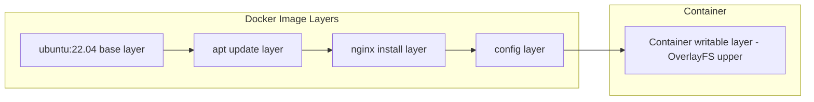
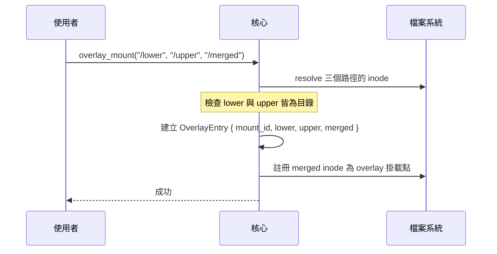

# OverlayFS (疊合檔案系統)

## 概述

OverlayFS (疊合檔案系統, overlay filesystem) 是一種聯合掛載檔案系統 (union mount filesystem)，將多個目錄疊合成一個單一目錄樹。OverlayFS 是 Docker 容器映像的核心技術，讓多個容器共用同一份唯讀基礎映像，同時各自擁有獨立的可寫層。

OverlayFS 於 2014 年合併入 Linux 3.18，取代了早期的 AUFS 和 Device Mapper。

## 基本原理

```mermaid
graph TD
    subgraph Overlay 掛載點 (/merged)
        M[merged] --> |查找順序: upper first| L
    end
    subgraph 下層層
        L[lower] --> A[基礎檔案系統 / 唯讀]
    end
    subgraph 上層層
        U[upper] --> B[容器 writable layer]
    end
```

OverlayFS 將兩個目錄疊合成一個掛載點：
- **下層 (lower)**: 唯讀的基礎層，通常為容器映像
- **上層 (upper)**: 可寫層，容器在此進行所有寫入操作

當讀取檔案時，OverlayFS 先查詢上層，若上層不存在則查詢下層。寫入操作僅影響上層（寫入時複製，copy-up）。

## 容器映像的分層結構

Docker 映像由多個唯讀層疊加而成：



xv8 的 OverlayFS 實作簡化為兩層：一個唯讀下層 + 一個可寫上層。

## xv8 實作

### 核心資料結構

```rust
pub struct OverlayEntry {
    pub mount_id: u64,
    pub lower: Inode,     // 下層目錄 inode
    pub upper: Inode,     // 上層目錄 inode
    pub merged: Inode,    // 疊合目錄 inode
}
```

xv8 使用全域的 `OVERLAY_TABLE` 管理所有 Overlay 掛載點：

```rust
pub static OVERLAY_TABLE: SpinLock<Vec<OverlayEntry>>;
```

### 掛載流程



### 路徑解析 (resolve_inner)

xv8 在 `fs.rs` 的 `resolve_inner` 函數中實作 Overlay 查找邏輯。當解析到 merged 目錄時，優先查詢 upper 目錄，若檔案不存在則查詢 lower 目錄：

```rust
// resolve_inner 中的簡化邏輯
if current_inode 是 overlay mount point {
    // 先查 upper 目錄
    if let Some(entry) = upper_inode.lookup(name) {
        return entry;
    }
    // 再查 lower 目錄
    if let Some(entry) = lower_inode.lookup(name) {
        return entry;
    }
}
```

### 系統呼叫

```rust
// 掛載 OverlayFS
overlay_mount("/lower", "/upper", "/merged");

// 卸載
overlay_umount("/merged");
```

## 寫入時複製 (Copy-on-Write)

OverlayFS 的關鍵行為：

| 操作 | 行為 |
|------|------|
| 讀取存在於上層的檔案 | 直接讀取上層 |
| 讀取僅存在於下層的檔案 | 讀取下層 |
| 寫入僅存在於下層的檔案 | 先複製到上層 (copy-up)，再寫入 |
| 刪除僅存在於下層的檔案 | 在上層建立 whiteout 檔案 |
| 建立新檔案 | 直接在上層建立 |

xv8 的實作目前使用 `overlay_create` 函數自動在 upper 層建立新檔案。

## 與其他機制的關係

```
容器檔案系統隔離:
  Namespace (CLONE_NEWNS) → 隔離掛載點視圖
    ↓
  pivot_root → 切換 root 到 Overlay 掛載點
    ↓
  OverlayFS → 提供分層檔案系統
```

- **Mount namespace**: 確保容器的掛載點不影響主機
- **pivot_root**: 將容器的 root 切換到 OverlayFS 掛載點
- **OverlayFS**: 提供映像共用與獨立寫入

## 相關文件

- [Wiki: 容器](Container.md)
- [Wiki: Namespace](Namespace.md)
- [xv8 kernel: overlay.rs](../../xv8/kernel/src/overlay.md)
- [_doc/v5.4.md](../../_doc/v5.4.md)
