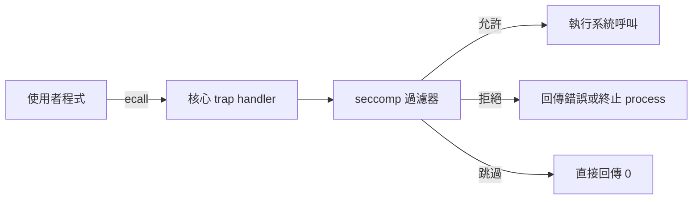
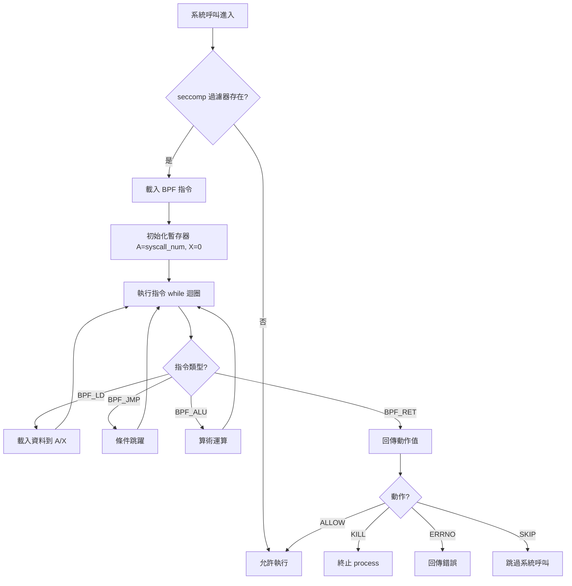
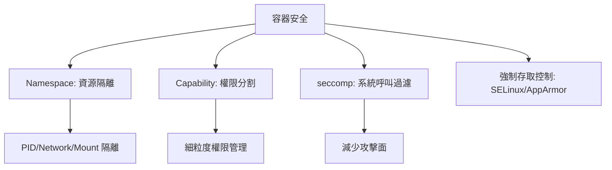

# seccomp (安全計算模式)

## 概述

seccomp (secure computing mode, 安全計算模式) 是 Linux 核心提供的一種安全機制，允許 process 限制自己及其子 process 可以使用的系統呼叫。seccomp 是容器安全的核心元件之一，與 namespace、capabilities 共同構成容器隔離的安全防線。

seccomp 最初於 2005 年加入 Linux 2.6.12，最初模式僅允許 `read`、`write`、`_exit`、`sigreturn` 四個系統呼叫。2012 年 Linux 3.5 引入 BPF (Berkeley Packet Filter) 模式的 seccomp (seccomp-bpf)，允許更精細的系統呼叫過濾規則。

## 基本原理

seccomp 在每個系統呼叫進入核心時插入一道檢查：



## 過濾器架構

seccomp-bpf 使用 BPF (Berkeley Packet Filter) 位元組碼定義過濾規則。每個規則檢查：

1. **系統呼叫編號** (arch-specific syscall number)
2. **系統呼叫參數** (可選)
3. **架構** (可選)

過濾器的回傳值 (action)：

| 動作 | 值 | 說明 |
|------|-----|------|
| `SECCOMP_RET_KILL` | 0x00000000 | 立即終止 process |
| `SECCOMP_RET_ALLOW` | 0x7fff0000 | 允許系統呼叫 |
| `SECCOMP_RET_ERRNO` | 0x00050000 + errno | 回傳錯誤碼 |
| `SECCOMP_RET_TRACE` | 0x7ff00000 | 通知 tracer |
| `SECCOMP_RET_SKIP` | 0x7fff0000 | 跳過系統呼叫 (xv8 專用) |

## xv8 實作

### BPF 過濾器執行

xv8 的 seccomp 實作在 `kernel/src/seccomp.rs` 中。不同於 Linux 使用完整的 BPF 虛擬機，xv8 使用指令指標 (instruction pointer) while 迴圈執行過濾器：

```rust
pub fn seccomp_check(syscall_num: usize) -> bool {
    // 取得當前 process 的 seccomp 過濾器
    // 如果過濾器為空，允許所有系統呼叫
    // 否則，執行 BPF 過濾器決定允許或拒絕
}
```

BPF 指令格式：

```rust
pub struct SockFprog {
    pub len: u16,              // 指令數量
    pub filter: *const SockFilter,  // 指令陣列
}

pub struct SockFilter {
    pub code: u16,   // BPF 指令碼
    pub jt: u8,      // 條件為真時的跳躍偏移
    pub jf: u8,      // 條件為假時的跳躍偏移
    pub k: u32,      // 通用欄位 (指令特定用途)
}
```

### seccomp_check 流程



### 特殊處理

xv8 的 seccomp 有一個特殊處理：**系統呼叫 144 (`seccomp` 自身)** 始終被跳過 (SKIP)，避免 process 設定 seccomp 後無法修改或移除，導致自我鎖定。

```rust
// seccomp_check 中的特殊處理
if syscall_num == 144 { // seccomp syscall
    return true; // 始終允許 seccomp 設定
}
```

## 系統呼叫

```rust
// 設定 seccomp 過濾器
// operation: 1 = SECCOMP_SET_MODE_FILTER
// flags: 0 = 一般, 1 = SECCOMP_FILTER_FLAG_TSYNC
seccomp(operation: u32, flags: u32, filter: *const SockFprog) -> Result<(), SysError>;
```

## 使用範例

```rust
// 定義 BPF 過濾器：僅允許 read(0), write(1), exit(93)
let filter = SockFprog {
    len: 5,
    filter: &[
        SockFilter { code: 0x20, jt: 0, jf: 0, k: 0 },                    // ld syscall_num
        SockFilter { code: 0x15, jt: 0, jf: 1, k: 0 },                     // jeq 0 → ALLOW (read)
        SockFilter { code: 0x15, jt: 0, jf: 1, k: 1 },                     // jeq 1 → ALLOW (write)
        SockFilter { code: 0x15, jt: 0, jf: 1, k: 93 },                    // jeq 93 → ALLOW (exit)
        SockFilter { code: 0x06, jt: 0, jf: 0, k: 0x00000000 },            // RET KILL
        SockFilter { code: 0x06, jt: 0, jf: 0, k: 0x7fff0000 },            // RET ALLOW (unreachable)
    ],
};
let _ = seccomp(1, 0, &filter);
```

## 與其他安全機制的關係



- **Namespace**: 隔離 process 能看見的資源
- **Capability**: 分割 root 權限為細粒度能力
- **seccomp**: 限制 process 能使用的系統呼叫
- 三者互補，共同縮小容器逃逸攻擊面

## 相關文件

- [Wiki: 容器](Container.md)
- [Wiki: Capability](Capability.md)
- [Wiki: Namespace](Namespace.md)
- [xv8 kernel: seccomp.rs](../../xv8/kernel/src/seccomp.md)
- [_doc/v5.3.md](../../_doc/v5.3.md)
