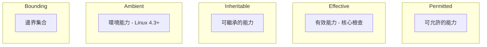

# Capability (能力) 模組 — capability.rs

## 理論背景

Capability (能力) 是一種將超級使用者 (root) 權限分割為細粒度單位的安全模型。傳統 Unix 中，UID 0 (root) 擁有一切權限，process 若非 root 即是普通使用者 ── 這是一種二元模型。Capability 將 root 權限拆分為獨立的能力，如 `CAP_NET_RAW` (允許原始 socket)、`CAP_SYS_ADMIN` (允許系統管理操作) 等。

Capability 的概念最早由 Dennis Ritchie 在 1979 年的 Unix 安全研究中提出，但直到 Linux 2.2 (1999) 才被核心實作。POSIX 1003.1e 草案 (1997) 定義了標準的能力模型，Linux 的實作大致遵循此標準。

## 能力集 (Capability Sets)

Linux 為每個 process 維護 5 個能力集：



| 集合 | 說明 |
|------|------|
| **Permitted (可允許)** | process 可擁有的能力上限 |
| **Effective (有效)** | 核心實際檢查的能力集合 |
| **Inheritable (可繼承)** | 子 process 可繼承的能力 |
| **Ambient (環境)** | 非特權 process 保留的能力 (Linux 4.3+) |
| **Bounding (邊界)** | 所有 process 的能力上限 |

## xv8 實作

### 五集合模型

xv8 實作完整的五集合能力模型：

```rust
pub struct CapabilitySets {
    pub permitted:   u64,  // 可允許
    pub effective:   u64,  // 有效
    pub inheritable: u64,  // 可繼承
    pub ambient:     u64,  // 環境
    pub bounding:    u64,  // 邊界
}
```

每個能力集合使用 `u64` 位元遮罩表示 ── 每個位元對應一個能力。xv8 定義 41 個能力，對應 Linux 的標準能力編號。

### capget/capset

```rust
pub fn sys_capget(args: &SyscallArgs) -> Result<usize, SysError> {
    // 讀取 header 與 data 結構
    // header 指定目標 process (未使用，固定為目前 process)
    // data 包含五個能力集
}

pub fn sys_capset(args: &SyscallArgs) -> Result<usize, SysError> {
    // 從 data 讀取新的能力集
    // 驗證權限 (僅允許 Permitted 內的能力)
    // 更新 process 的能力集
}
```

### 權限檢查邏輯

xv8 的權限檢查與 Linux 一致：
1. 若 process 具有 `CAP_SYS_ADMIN`，可跳過多數權限檢查
2. 個別操作檢查對應的能力（如原始 socket 需要 `CAP_NET_RAW`）
3. 能力繼承遵循 Linux 的規則（Effective ∩ Permitted 等）

### exec 時的能力轉換

當 process 執行 `exec` 時，能力集根據以下規則轉換：

```
Permitted'   = Permitted ∩ Bounding
Effective'   = (若為特權 binary) Permitted' 否則 0
Inheritable' = Inheritable
Ambient'     = Ambient ∩ Permitted' (Linux 4.3+)
```

## 系統呼叫

| 編號 | 名稱 | 原型 |
|------|------|------|
| 142 | `capget` | `(hdr: *const CapHeader, data: *mut CapData)` |
| 143 | `capset` | `(hdr: *const CapHeader, data: *const CapData)` |

## 與 seccomp 的關係

Capability 與 seccomp 互補：
- **Capability**: 控制 process 能做什麼（系統層級的操作）
- **seccomp**: 控制 process 能使用哪些系統呼叫
- 兩者搭配：即使 process 有 `CAP_SYS_ADMIN`，seccomp 仍可封閉 `mount` 系統呼叫

## 相關文件

- [Wiki: Capability](../../../_wiki/Capability.md)
- [Wiki: seccomp](../../../_wiki/seccomp.md)
- [Wiki: 容器](../../../_wiki/Container.md)
- [syscall 文件](syscall.md)
- [proc 文件](proc.md)
