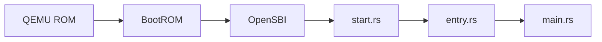

# Entry — 核心進入點

## 概述

`entry.rs` 是 xv8 核心在 Rust 層級的第一個執行點，但在此之前已經過啟動載入器（`start.rs` / `entry.S`）的組合語言初始化。此模組負責完成從組合語言到 Rust 的轉換，並初始化執行期環境。

## 啟動流程

1. **QEMU BootROM**: 載入核心映像到實體位址 `0x80000000`
2. **OpenSBI**: 初始化 S 模式（Supervisor Mode），提供 ecall 服務
3. **start.rs**: 組合語言層級的最小初始化——設定堆疊指標、清除 BSS
4. **entry.rs**: Rust 進入點，完成進階初始化後呼叫 `main()`

## 初始化任務

`entry.rs` 執行以下關鍵初始化：

1. **BSS 清理**：確認未初始化的全域變數歸零
2. **堆疊配置**：為每個 CPU 設定核心堆疊（guard page 保護）
3. **Trap 向量設定**：將 `stvec` CSR 指向 `kernelvec` 或 `uservec`
4. **CPU 識別**：讀取 `mhartid` CSR 取得當前 CPU ID
5. **中斷狀態**：確保初始時中斷關閉
6. **呼叫 `main()`**：跳轉到核心主初始化函式

## M 模式與 S 模式

RISC-V 支援三種特權模式：M（Machine）、S（Supervisor）、U（User）。xv8 核心運行於 S 模式，M 模式由 OpenSBI 佔用。系統呼叫透過 `ecall` 從 U 模式陷入 S 模式。

## 相關文件

- [start.md](./start.md) — 組合語言啟動流程
- [main.md](./main.md) — 核心主初始化
- [riscv.md](./riscv.md) — RISC-V 架構說明
- [trap.md](./trap.md) — 陷阱向量設定
