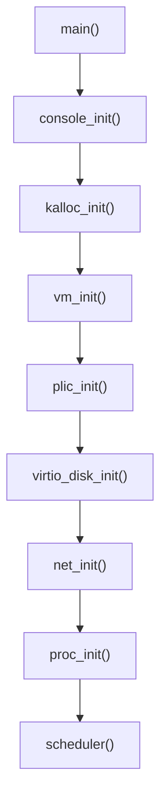

# Main — 核心主初始化序列

## 概述

`main.rs` 是 xv8 核心的初始化協調器，在 `entry.rs` 完成最小設定後被呼叫。它依序初始化所有核心子系統，最後啟動第一個使用者行程（init）並進入排程迴圈。

## 初始化序列

### 各步驟說明

1. **console_init**: 初始化 UART 與控制臺，讓 `printf` 可以輸出
2. **kalloc_init**: 根據實體記憶體大小，初始化 buddy allocator
3. **vm_init**: 建立核心頁表，映射核心程式碼與資料、UART、PLIC、virtio 等裝置 MMIO 區域
4. **plic_init**: 設定平台層級中斷控制器（PLIC），初始化中斷向量
5. **virtio_disk_init**: 探測 virtio 儲存裝置，初始化檔案系統
6. **net_init**: 探測 e1000 網路卡，初始化網路協定棧
7. **proc_init**: 初始化行程表與排程器資料結構
8. **scheduler**: 進入排程主迴圈，開始執行使用者行程

## 多 CPU 啟動

在多核心組態中，只有 CPU 0（boot hart）執行完整的初始化序列。其他 CPU 在 `entry.rs` 中等待，收到 SGI（軟體產生的中斷）後才各自執行 per-CPU 初始化並進入排程器。

## 第一個行程

初始化完成後，核心從檔案系統載入 `/init` 二進位檔，為其建立頁表與堆疊，設定為 PID 1 並放入就緒佇列。排程器隨後接手，開始執行使用者空間的 init 程式。

## 相關文件

- [entry.md](./entry.md) — 核心進入點
- [kalloc.md](./kalloc.md) — 實體記憶體分配器
- [vm.md](./vm.md) — 虛擬記憶體管理
- [proc.md](./proc.md) — 行程管理
- [console.md](./console.md) — 控制臺驅動
- [virtio_disk.md](./virtio_disk.md) — Virtio 磁碟驅動
