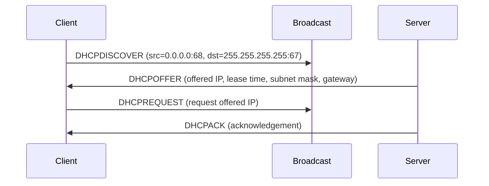

# DHCP — 動態主機設定協定（RFC 2131）

## 概述

DHCP（Dynamic Host Configuration Protocol）讓網路裝置自動取得 IP 位址、子網路遮罩、閘道器與 DNS 伺服器等設定參數，無需手動設定。

## DORA 交握

1. **DHCPDISCOVER**: 用戶端廣播尋找 DHCP 伺服器
2. **DHCPOFFER**: 伺服器回應可用的 IP 位址
3. **DHCPREQUEST**: 用戶端正式請求該 IP
4. **DHCPACK**: 伺服器確認分配

## 租約管理

DHCP 分配的 IP 位址有租約期限（lease time）。用戶端需在到期前續約（RENEWING 狀態），若無法續約則釋放位址。

## 相關文件

- [udp.md](./udp.md) — UDP 傳輸層
- [interface.md](./interface.md) — 網路介面
- [mod.md](./mod.md) — 協定棧總覽
