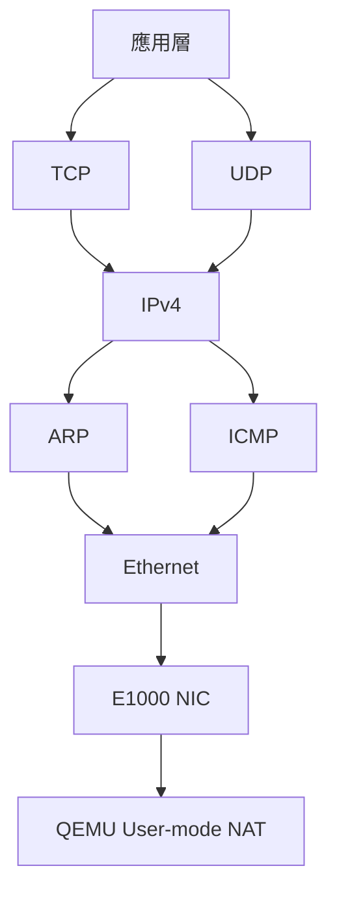

# 網路堆疊 — net/

xv8 的網路堆疊 (`kernel/src/net/`) 實作 Ethernet、ARP、IPv4、ICMP、UDP、TCP 通訊協定，搭配 E1000 PCIe 網路卡驅動程式。

## 協定層次

## 模組列表

| 檔案 | 協定 | RFC |
|------|------|-----|
| `eth.rs` | Ethernet II | RFC 894 |
| `arp.rs` | ARP (Address Resolution Protocol) | RFC 826 |
| `ipv4.rs` | IPv4 | RFC 791 |
| `icmp.rs` | ICMP (Internet Control Message Protocol) | RFC 792 |
| `udp.rs` | UDP (User Datagram Protocol) | RFC 768 |
| `tcp.rs` | TCP (Transmission Control Protocol) | RFC 9293 |
| `dhcp.rs` | DHCP (Dynamic Host Configuration Protocol) | RFC 2131 |
| `route.rs` | 路由表 | - |
| `interface.rs` | 網路介面抽象 | - |
| `loopback.rs` | Loopback 裝置 (`127.0.0.1`) | - |
| `veth.rs` | Veth pair (容器網路) | - |
| `ping.rs` | Ping (ICMP Echo) | RFC 792 |

## xv8 網路特點

- **E1000 NIC**: 模擬 Intel 82540EM，MMIO 位址 `0x40000000`
- **QEMU NAT**: `-netdev user,id=net0 -device e1000,netdev=net0`
- **DHCP**: 啟動時自動取得 IP
- **Loopback**: `127.0.0.1` 用於本機程序通訊
- **Veth pair**: 容器網路隔離與連接

## 相關文件

- [Wiki: 網路堆疊](../../../../_wiki/net/Network-Stack.md)
- [net 工具集 README](../../../../net/README.md)
- [e1000 驅動文件](../e1000.md)
