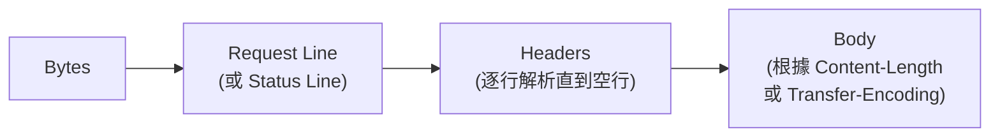

# Parse — HTTP 協定解析器

`parse.rs` 實作 HTTP/1.1 訊息的手工解析器（parser）。不同於正則表達式，手工解析器逐位元組處理輸入，提供高效且符合規範的解析。

## 解析流程

HTTP 訊息解析分為兩個階段：

### 起始行（Start Line）

**請求起始行**: `METHOD URI HTTP/1.1\r\n`
**回應起始行**: `HTTP/1.1 STATUS_CODE REASON_PHRASE\r\n`

### 標頭區

遵循 RFC 7230 的標頭解析規則：

- 每行格式為 `Header-Name: value\r\n`
- 折行（obsolete line folding）使用 `\t` 或空格開頭的續行
- Connection: keep-alive 與 upgrade 等特殊標頭處理
- 空行結束標頭區

### 主體解析

主體長度由以下規則決定（優先序）：

1. Transfer-Encoding: chunked
2. Content-Length
3. Connection: close（讀取直到連線關閉）

## 相關文件

- [request.md](./request.md) — 請求結構
- [response.md](./response.md) — 回應結構
- [header.md](./header.md) — 標頭解析
- [body.md](./body.md) — 主體解析
