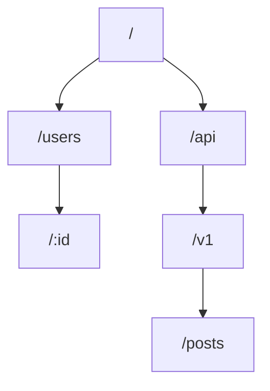

# Router — 路由器核心

`router.rs` 實作 HTTP 路由器，負責根據 HTTP 方法與路徑將請求分派到對應的處理器。

## 路由匹配

Router 使用樹狀結構（trie）儲存路由規則：



## 路由語法

- **靜態路由**: `/users/profile` — 完全匹配
- **動態段落**: `/users/:id` — 匹配單一路徑段落，值傳遞給 handler
- **萬用路由**: `/static/*path` — 匹配剩餘所有路徑段落

## 方法分派

Router 對每條路徑維護一個方法映射表：

```rust
router
    .get("/users", list_users)
    .post("/users", create_user)
    .get("/users/:id", get_user)
    .delete("/users/:id", delete_user)
```

## 相關文件

- [handler.md](./handler.md) — 請求處理器
- [into_response.md](./into_response.md) — 回應轉換
- [lib.md](./lib.md) — Router 總覽
- [method.md](../../xv8-http/src/method.md) — HTTP 方法
