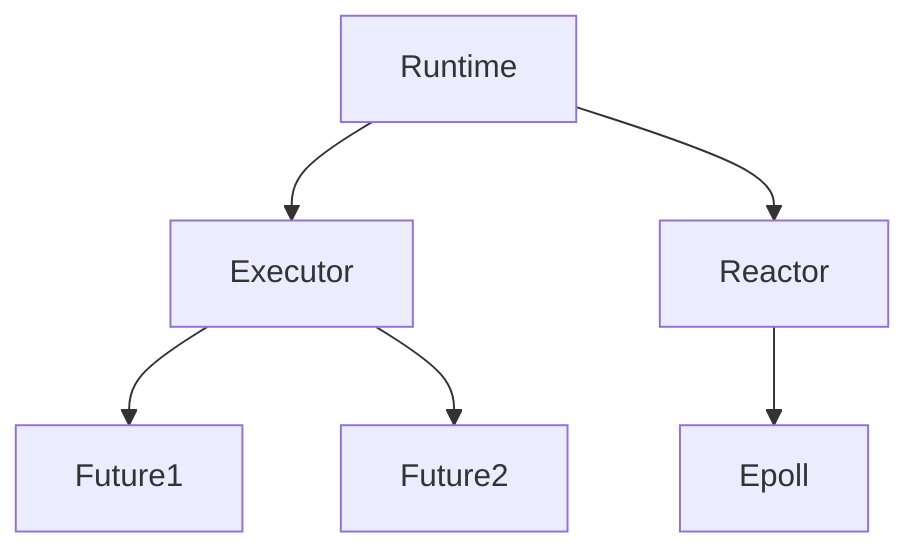

# Runtime — Tokio 執行期相容層

`runtime.rs` 提供與 `tokio::runtime` 相容的執行期（runtime）API，封裝 xv8-async 的 executor 與 reactor。

## Runtime 架構

- **Runtime::new()**: 建立新的 async runtime，初始化 executor 與 reactor
- **Runtime::block_on(future)**: 在當前執行緒執行 Future 直到完成
- **Runtime::spawn(task)**: 將 task 提交給 executor 排程

## 設計限制

xv8-tokio-compat 的 runtime 為單執行緒（single-threaded），不支援 work-stealing 或多執行緒排程。這符合 xv8 目前的單 CPU/QEMU 環境。

## 相關文件

- [lib.md](./lib.md) — Tokio 相容層總覽
- [lib.md](../../xv8-async/src/lib.md) — xv8 非同步執行期
